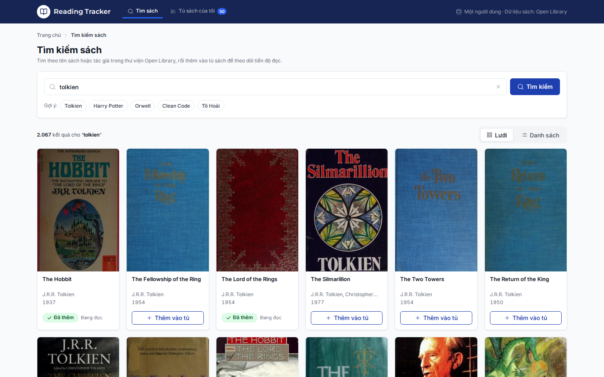
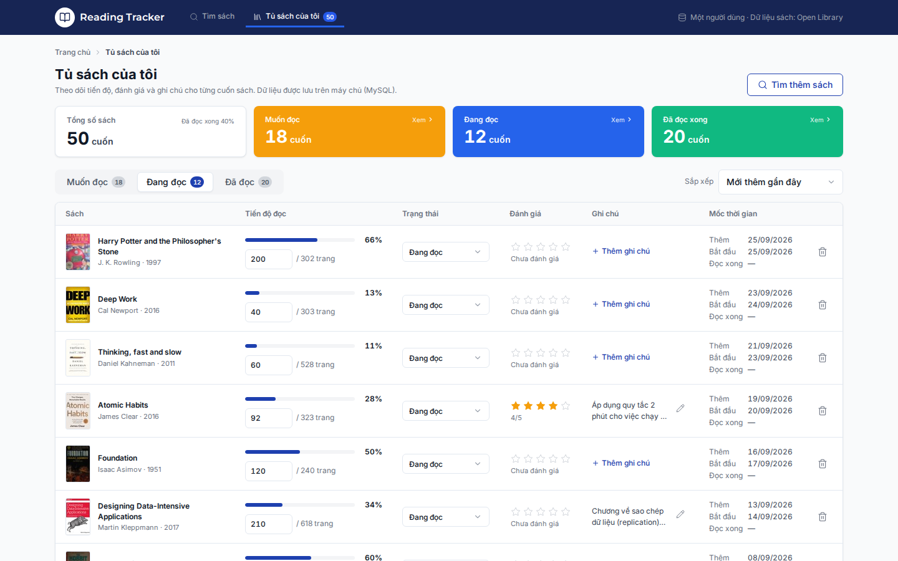
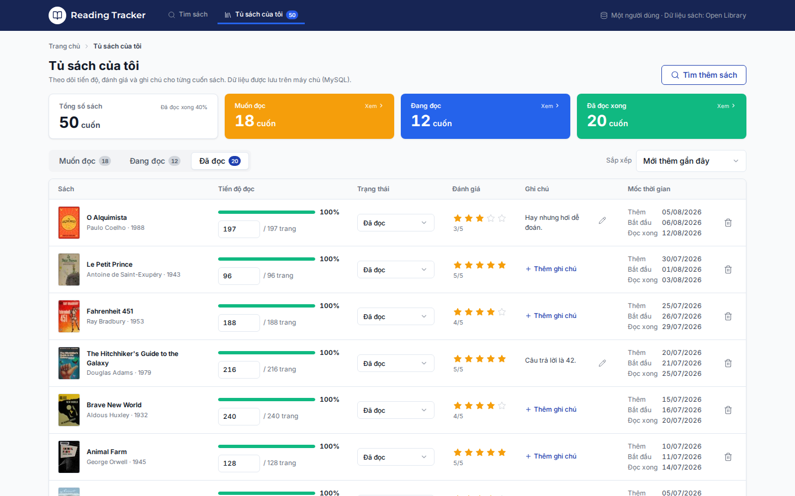
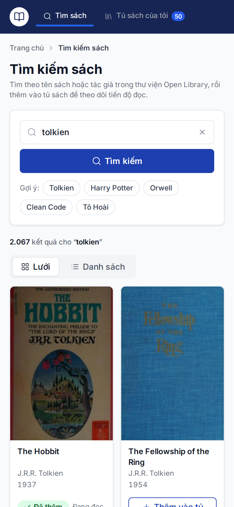
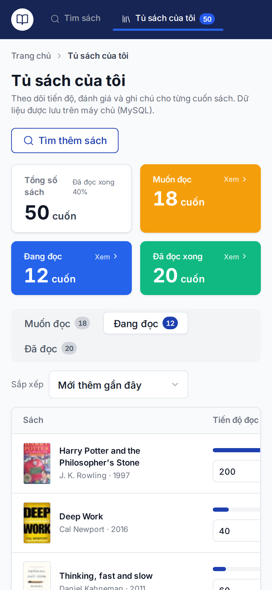

# Mini Reading Tracker

Ứng dụng web theo dõi tiến độ đọc sách cá nhân. Tìm sách từ [Open Library](https://openlibrary.org), lưu vào tủ sách, cập nhật tiến độ, đánh giá và ghi chú. Không cần đăng nhập — dành cho một người dùng.

---

## Demo Links

- **Frontend URL**: [https://baonq.site](https://baonq.site)
- **Backend API**: [https://baonq.site/api](https://baonq.site/api)
- **Swagger Docs**: [https://baonq.site/api/docs](https://baonq.site/api/docs)

---

## Ảnh chụp màn hình

| Tìm kiếm sách | Chi tiết sách |
|---|---|
|  |  |

| Tủ sách — Đang đọc | Tủ sách — Đã đọc (đánh giá, ghi chú) |
|---|---|
|  |  |

| Điện thoại (390px) — Tìm kiếm | Điện thoại (390px) — Tủ sách |
|---|---|
|  |  |

---

## Công nghệ

| Layer | Stack |
|---|---|
| Frontend | Vue 3 · Vite 5 · Pinia · Vue Router 4 (JS) |
| Backend | Node.js 18+ · Express 4 · Sequelize 6 (JS) |
| Database | MySQL 8 / MariaDB 10.6+ |
| External API | [Open Library](https://openlibrary.org/developers/api) — miễn phí, không cần API key |

---

## Chạy local

### Yêu cầu
- Node.js ≥ 18
- MySQL 8 hoặc MariaDB 10.6+

### 1. Cài đặt toàn bộ dependencies (Root)

```bash
npm install          # Cài đặt cho cả root, backend và frontend
```

### 2. Khởi động Database (Docker)

```bash
npm run db:up        # Chạy container MySQL 8.4 trên cổng 127.0.0.1:3317
```

### 3. Cấu hình & Migration DB

```bash
# Cấu hình backend .env (nếu chưa có)
cp backend/.env.example backend/.env

# Chạy migration và nạp dữ liệu mẫu bằng 1 lệnh từ root:
npm run db:migrate
npm run db:seed
```

### 4. Chạy toàn bộ ứng dụng bằng 1 lệnh duy nhất

```bash
npm run dev
```

> Lệnh trên sẽ tự động chạy đồng thời:
> - **Backend**: `http://localhost:3000` (Nodemon hot-reload)
> - **Frontend**: `http://localhost:5000` (Vite dev server)
> 
> Frontend tự động proxy toàn bộ request `/api/*` sang backend `http://localhost:3000`.

### 5. Build production frontend

```bash
npm run build        # output: frontend/dist/
```

---

## Kiến trúc

```
Browser
  │  (HTTPS)
  ▼
Nginx / aaPanel
  ├── /          → serve frontend/dist/ (static)
  └── /api/*     → reverse proxy → Node.js :3000
                        │
                        ├── Express Router
                        ├── Controllers  (validate input)
                        ├── Services     (business rules)
                        ├── Sequelize    (ORM)
                        └── MySQL        (shelf_books)
                                │
                        Open Library API
                        (search, work detail, covers)
```

**Luồng dữ liệu:**
- Frontend gọi `/api/*` — không bao giờ gọi trực tiếp Open Library.
- Backend cache kết quả tìm kiếm (TTL 10 phút) và chi tiết sách (TTL 24h) trong bộ nhớ để giảm latency.

---

## Database Schema

```
shelf_books
──────────────────────────────────────────────────────
id               INT UNSIGNED  PK AUTO_INCREMENT
work_id          VARCHAR(20)   UNIQUE NOT NULL
title            VARCHAR(500)  NOT NULL
authors          JSON          NOT NULL
cover_id         INT UNSIGNED  NULL
first_publish_year SMALLINT   NULL
total_pages      INT UNSIGNED  NULL
status           ENUM('want_to_read','reading','read')  DEFAULT 'want_to_read'
current_page     INT UNSIGNED  DEFAULT 0
rating           TINYINT UNSIGNED  NULL   (1–5)
note             VARCHAR(500)  NULL
started_at       DATE          NULL
finished_at      DATE          NULL
added_at         DATETIME      NOT NULL   (createdAt)
updated_at       DATETIME      NOT NULL
──────────────────────────────────────────────────────
INDEX ix_shelf_books_status_added (status, added_at)
```

---

## Danh sách API & Swagger UI

Tài liệu tương tác: **Swagger UI** tại [`/api/docs`](http://localhost:3000/api/docs) (OpenAPI JSON tại [`/api/docs.json`](http://localhost:3000/api/docs.json)), dựng trực tiếp từ hợp đồng OpenAPI 3.1 tại [`backend/src/docs/openapi.yaml`](backend/src/docs/openapi.yaml).

### Bảng tóm tắt Endpoints

| Method | Path | Request / Params | Response & Status | Mô tả |
|---|---|---|---|---|
| `GET` | `/api/health` | Không | `200` — `{ data: { status, database } }` | Kiểm tra backend và kết nối MySQL |
| `GET` | `/api/books/search` | `?q={keyword}&page={n}` | `200` — `{ data: [...], pagination: { ... } }` | Tìm kiếm sách qua Open Library (20 kết quả/trang, cache 10p). Kèm `inShelf`, `shelfStatus` |
| `GET` | `/api/books/suggestions` | `?page={n}` | `200` — `{ data: [...] }` | Danh sách sách gợi ý theo chủ đề |
| `GET` | `/api/books/:workId` | Path `workId` (vd: `OL45804W`) | `200` — `{ data: { ..., shelfEntry } }` | Chi tiết sách (title, authors, description, subjects, covers...). Tự động kèm dữ liệu cá nhân nếu đã trong tủ |
| `GET` | `/api/covers/:coverId` | `?size=S\|M\|L` | Image stream (`image/jpeg`) | Proxy ảnh bìa từ Covers Open Library (cache 24h) |
| `GET` | `/api/shelf` | `?status=all\|want_to_read\|reading\|read&sort=recent\|title\|progress\|rating` | `200` — `{ data: [...], counts: { total, wantToRead, reading, read } }` | Danh sách tủ sách cá nhân theo tab và sắp xếp, kèm thống kê nhanh |
| `POST` | `/api/shelf` | Body: `{ workId, status? }` | `201 Created` / `409 Conflict` | Thêm sách vào tủ. Trùng sách báo lỗi `409 CONFLICT` |
| `PATCH` | `/api/shelf/:workId` | Body: `{ currentPage?, status?, rating?, note? }` | `200` — `{ data, meta: { autoFinished } }` | Cập nhật tiến độ. Tự động chuyển `read` khi đọc hết số trang |
| `DELETE` | `/api/shelf/:workId` | Path `workId` | `204 No Content` | Xoá sách khỏi tủ sách cá nhân |

### Định dạng phản hồi thống nhất (Unified Response Envelope)

- **Thành công:**
```json
{
  "data": { ... }
}
```

- **Thành công kèm metadata (ví dụ PATCH khi tự động hoàn thành sách):**
```json
{
  "data": { ... },
  "meta": {
    "autoFinished": true
  }
}
```

- **Lỗi (Mã lỗi, thông báo tiếng Anh chuẩn REST, chi tiết trường vi phạm):**
```json
{
  "error": {
    "code": "VALIDATION_ERROR",
    "message": "Validation failed.",
    "details": [
      {
        "field": "currentPage",
        "message": "Current page cannot exceed total pages (450)."
      }
    ]
  }
}
```

**Mã lỗi chuẩn:** `VALIDATION_ERROR` (400), `NOT_FOUND` (404), `CONFLICT` (409), `UPSTREAM_ERROR` (502), `INTERNAL_ERROR` (500).

---

## Quy tắc nghiệp vụ

| Rule | Mô tả |
|---|---|
| Không trùng lặp | Thêm sách đã có trong tủ → 409 Conflict |
| Giới hạn trang | `currentPage` phải ≥ 0 và ≤ `totalPages` |
| Auto-finish | `currentPage = totalPages` → tự chuyển sang `read`, ghi `finishedAt` |
| Auto-revert | `currentPage < totalPages` khi đang `read` → tự chuyển về `reading` |
| Ngày bắt đầu | Chuyển sang `reading` lần đầu → ghi `startedAt = today` |
| Ngày kết thúc | Chuyển sang `read` → ghi `finishedAt = today` |
| Rating | Số nguyên 1–5, nullable |
| Note | Tối đa 500 ký tự, normalized NFC |

---

## Deploy (aaPanel / Nginx VPS cho domain baonq.site)

### Cấu trúc trên server

```
/www/wwwroot/baonq.site/
├── backend/          ← Node.js app (PM2 :3000)
├── frontend/dist/    ← Static bundle (Nginx phục vụ trực tiếp)
```

### Các bước triển khai

```bash
# 1. Trỏ DNS Domain:
#    - Record A: @     -> <IP_VPS>
#    - Record A: www   -> <IP_VPS>

# 2. Clone repo vào thư mục web:
git clone https://github.com/nqb3010/mini-reading-tracker.git /www/wwwroot/baonq.site
cd /www/wwwroot/baonq.site

# 3. Cài đặt toàn bộ dependencies (bao gồm Vite để build frontend):
npm install --include=dev

# 4. Cấu hình Backend & Database:
cp backend/.env.example backend/.env
# Chỉnh sửa backend/.env: điền thông tin kết nối MySQL (DB_HOST, DB_USER, DB_PASS, DB_PORT)
npm run db:migrate
npm run db:seed

# 5. Khởi động Backend 24/7 với PM2:
pm2 start backend/src/server.js --name reading-tracker-api
pm2 save
pm2 startup

# 6. Build Frontend:
npm run build        # output sinh ra thư mục /www/wwwroot/baonq.site/frontend/dist/
```

### Cấu hình Nginx Virtual Host (baonq.site)

```nginx
server {
    listen 80;
    listen [::]:80;
    server_name baonq.site www.baonq.site;

    # Tự động redirect sang HTTPS
    return 301 https://$host$request_uri;
}

server {
    listen 443 ssl http2;
    listen [::]:443 ssl http2;
    server_name baonq.site www.baonq.site;

    # Chứng chỉ Let's Encrypt SSL (tạo qua aaPanel hoặc certbot)
    # ssl_certificate     /www/server/panel/vhost/cert/baonq.site/fullchain.pem;
    # ssl_certificate_key /www/server/panel/vhost/cert/baonq.site/privkey.pem;

    root /www/wwwroot/baonq.site/frontend/dist;
    index index.html;

    # Nén Gzip
    gzip on;
    gzip_types text/plain text/css application/json application/javascript text/xml application/xml text/javascript;

    # Frontend Single Page App (Vue Router HTML5 history mode)
    location / {
        try_files $uri $uri/ /index.html;
    }

    # Reverse proxy toàn bộ request /api sang Node.js Express backend
    location /api/ {
        proxy_pass         http://127.0.0.1:3000;
        proxy_http_version 1.1;
        proxy_set_header   Upgrade $http_upgrade;
        proxy_set_header   Connection 'upgrade';
        proxy_set_header   Host $host;
        proxy_set_header   X-Real-IP $remote_addr;
        proxy_set_header   X-Forwarded-For $proxy_add_x_forwarded_for;
        proxy_set_header   X-Forwarded-Proto $scheme;
        proxy_cache_bypass $http_upgrade;
    }
}
```

---

## Giả định & Hạn chế

- **Single user** — không có auth, mọi người truy cập cùng một tủ sách.
- **Open Library rate limit** — API công khai, không có SLA. Cache phía backend giảm thiểu request.
- `totalPages` và `coverId` lấy từ kết quả search (`number_of_pages_median`, `cover_i`); một số sách thiếu dữ liệu.
- Không có real-time sync giữa nhiều tab — reload để cập nhật khi mở nhiều tab.

## Hướng cải thiện nếu có thêm thời gian

- Thêm authentication (JWT) để hỗ trợ nhiều người dùng.
- Thêm unit tests cho shelf.rules.js và integration tests cho các endpoints.
- Infinite scroll thay cho phân trang.
- Export tủ sách ra CSV / PDF.
- Statistic nâng cao: biểu đồ số sách đọc theo tháng.
